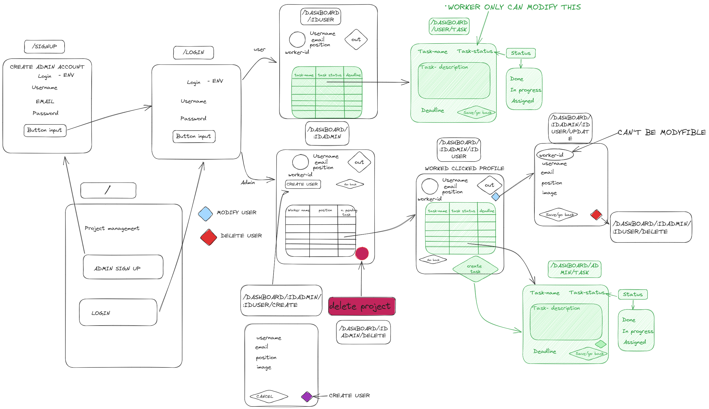

# Project 2 (Ticket & workers System)

## The team (Yago, Juanda, Joan)

### Languages, frameworks & libraries:
- HTML
- CSS
- JS
- Express
- Mongoose
- MongoDB
- ENV 
- HBS 
- Bcriptjs

### Frimeware
[Link to excalidraw](https://excalidraw.com/#json=2b6py-mhfn2U_T7fcmX2r,sxv8ar3zYy-BIiZHUI0fHQ)

### Routes
| Route | HTTP Verb | Description           |
| ----- | --------- | --------------------- |
| `/`   | GET       | It goes to the home page |
| `/signup` | GET   | It goes to the signup page |
| `/signup` | POST  | It creates a new user on our DB |
| `/login` | GET    | It goes to the login page |
| `/login` | POST   | It checks if the user exits, starts the session of it on our website and redirect them on to the admin dashboard |
| `/dashboard/:iduser` | GET    | It goes to the user dashboard |
| `/dashboard/:idadmin`| GET    | It goes to the admin dashboard |
| `/dashboard/:idadmin/delete`| POST | It deletes the admin user and every worker from in relation with that admin |
| `/dashboard/:idadmin/:iduser` | GET   | It shows the user information |
| `/dashboard/:idadmin/:iduser/create` | GET   | It goes to the user form creator using the create user button |
| `/dashboard/:idadmin/:iduser/create` | POST  | It creates the user with the form inputs using the create uset button |
| `/dashboard/:idadmin/:iduser/update` | GET   | It goes to a form with the user data where you can modify it |
| `/dashboard/:idadmin/:iduser/update` | POST  | It updates the user with the modyfied fields in the form |
| `/dashboard/:idadmin/:iduser/delete` | POST  | It deletes the user detected |

### MODELS

- User
    - username : {
        type: String, 
        required: true}
    - email : {
        type: String, 
        required: true}
    - password : 
        {type: String, 
        required: true}

- Admin
    - username : {
        type: String, 
        required: true}
    - email : {
        type: String, 
        required: true}
    - password : 
        {type: String, 
        required: true}
    - collaborators : [{
        type: Schema.Types.ObjectId,
        ref: "User"
    }]